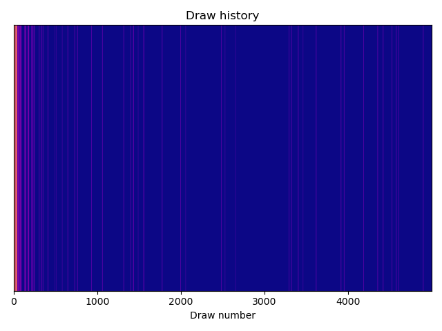
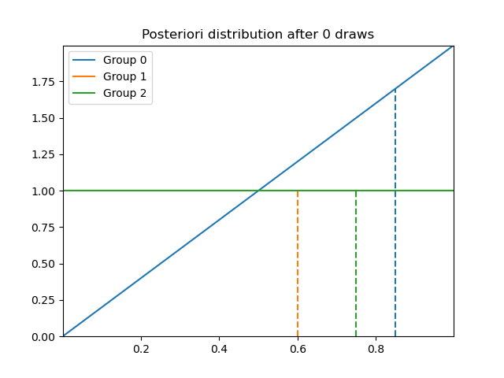
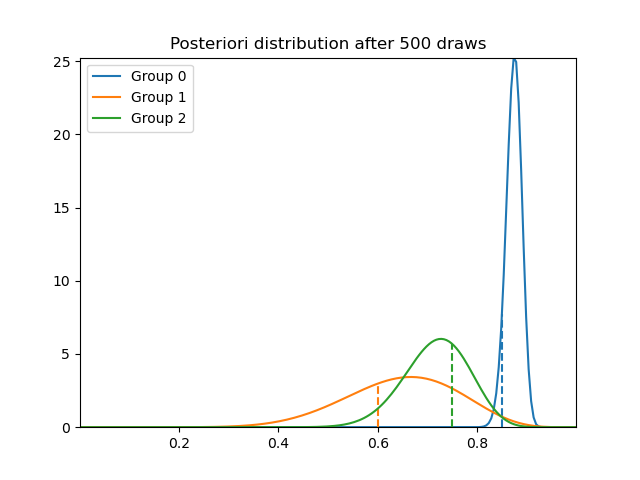
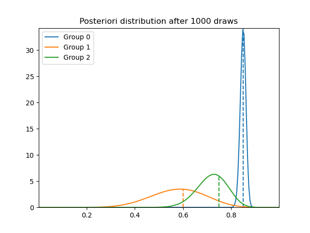
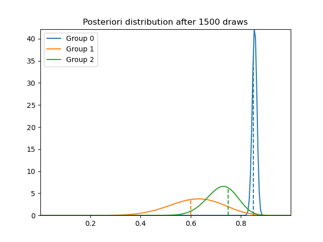
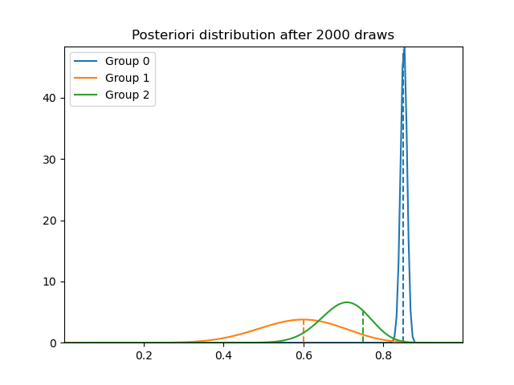
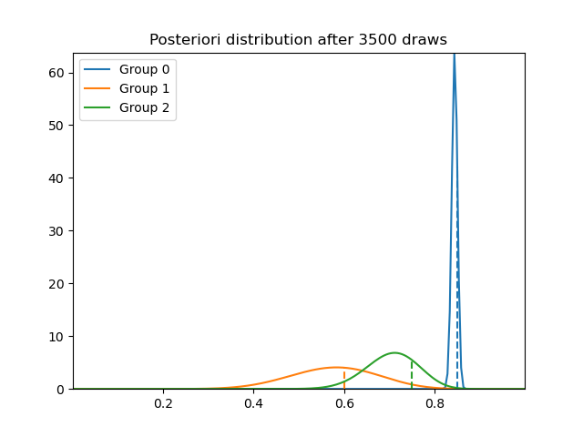
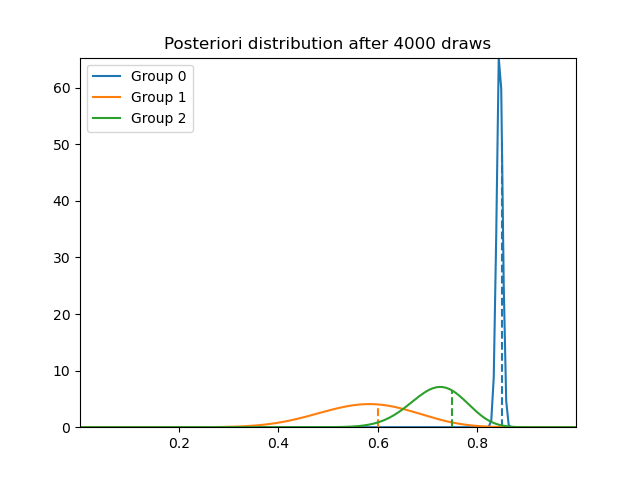
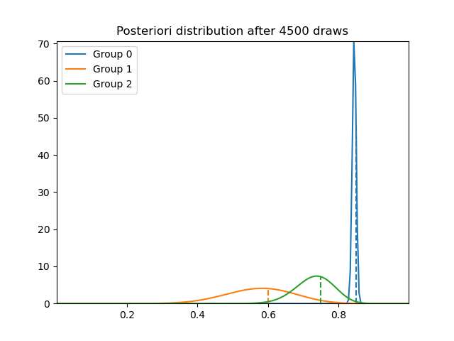

## Multi-Armed Bandits

A Bayesian inference approach to the multi-armed bandits problem.

The goal is to continuously gather data from all possible options and, simultaneously, learn the most favourable option. As a concrete example, the options can be different advertisements with the most favourable option being the one that leads to the most sales. This continuous learning approach allows us to quickly learn which advertisements work best and thus show these ones more to potential clients. An alternative naive approach is to show each advertisement 1000 times, then decide which advertisement worked best and move forward with that one. 

The figure below shows a draw history of 3 different options. The different colors represent the 3 different groups that we can draw from.
Initially, the draws are made randomly as can be seen by the blend of the different colors. As we draw more, we gather more information about the groups' distributions and, therefore, can make a better educated guess about the most favourable one and draw more often from this group.
This is depicated by the later stages of the graph being overwhelmingly blue.

Going back to our advertisement example, this is as if we start by showing 3 advertisements and, as we gather more information about which advertisement works best, we show more of the best advertisement. This is a better approach than the naive one we discussed above, as we do not lose too much time (or money or potential sales) with the ineffective advertisements.

  

We update the posteriori distributions as we draw more and more from the 3 groups. Note that 

